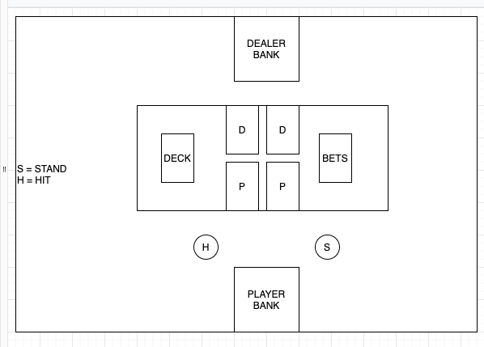
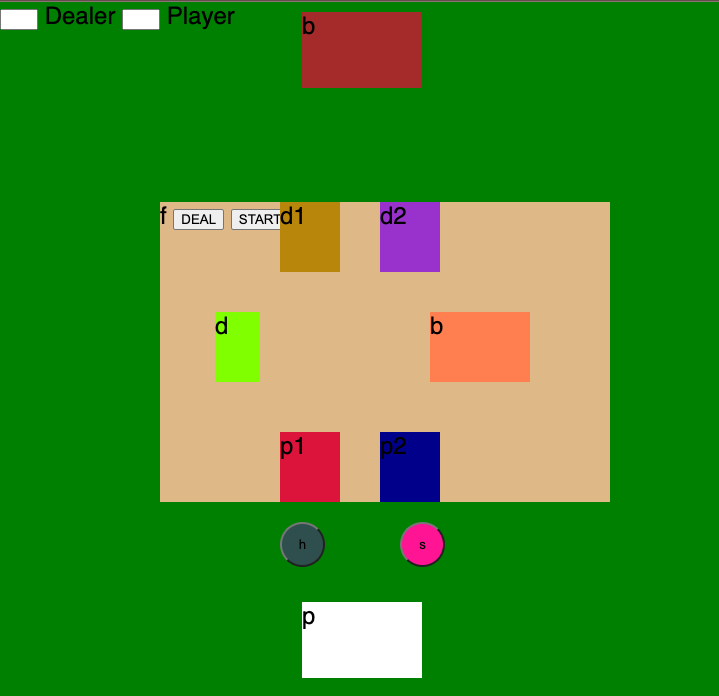
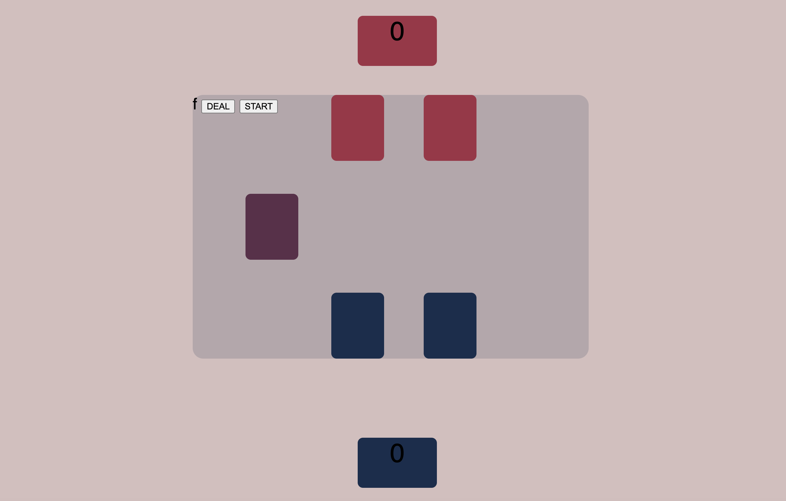

# BLACKJACK
I created a simple blackjack game that is playable and you can compete against the computer.

***
Description
***
I am a big fan of card based games that involve gambling  and have been playing them for a few years now casually. 
[Want to play ?](https://treymeetsworld.github.io/1st-Project-BlackJack/)

***
Here is the visual planning process:
My first design of the wireframe.

***
My initial css addition for basic visual reference.

***
My final design.

***
### Rules 
***
* Deck of 52 cards
* Player chooses between hit or stand
* Hit  = get another card
* Stand = compare cards with dealer
* dealer and player get two cards each
* Points 
* Numbered cards keep their value
* K,Q,J are 10 points
* A is 1 or 11
* Hoever has 21 or closest to it wins
* If player stands whoever has more than 21 loses
* Get as close to 21 as possible or have a higher pair than the other player
* If both players have the same points it is a draw
* If both players have the same points it is a draw
* ***
### Technology Used
-----
* HTML
* Javascript
* CSS
* Git
***
Challenges
### 
***
- My initial css setup.
- Functions simplicity.
***
***
Future Goals
***
* Add betting aspect
* Make the page responsive and use better css
* Create a halloween theme based on dark mode
